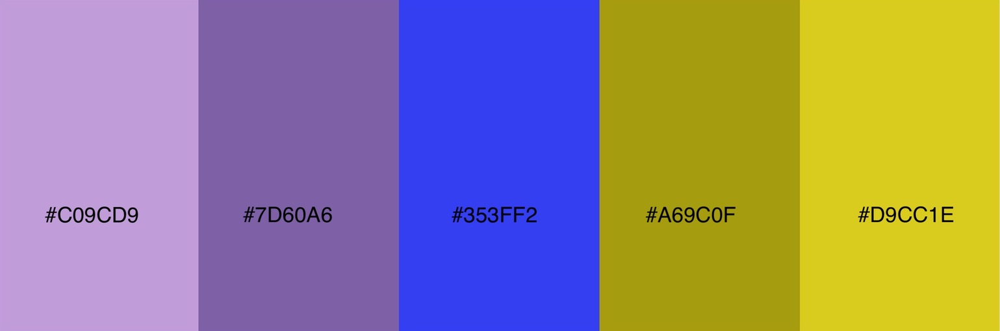

## 1. Project

  I aim to develop and test a platform to enable individuals life by setting and planning their goals. “Failing to plan is planning to fail”; “You become what you think about most of the time”.  
  This platform will enable people to edit their goals, store them according to priority. The Individual is encouraged to use a forum to publish accomplishments.

## 2. UX

### 2.1 __Typography__

    Fonts selected:  
    _Red Rose_ for title;  
    _Noto Sans_ throughout work;

### 2.2 __Colour Scheme__: 
Selected a trending scheme colour including lively colours, inspired by this [photo](https://www.behance.net/gallery/45528461/Selectologie) using [ adobe color ](color.adobe.com) software.  
 

### 2.3 __User Story__:
  * as user should be able to add goals;
  * as visiting user should be able to visit my goals;
  * as user should be able to edit goals; 

### 2.4 __Features__:
  * __Header__ (this feature is present in every page):  
    a) __Logo__ on the Left side with link to home page;  
    b) __3 vertical dots__ (mobile view) on the right side of navigation bar - opens into a menu with links to Home, My Progress and New Goal pages;  
    c) __Pages Links__ (desktop view) links to Home, My Progress and New Goal pages.

  * __Footer__ (this feature is present in every page):  
    a) __social media Icons__ - with link to social media pages;

  * __Home page__:   
    a) header and footer as explained above;  
    b)__Add__ add button that links to the Goals form page - mobile size screen only;  
    c) __goals overview__ 3 card with a goal each are present on the home page. These cards are static as there is no backend support for the data added to the form;   

  * __Goals form page__(the forms in this page are disabled as there is no backend support at this stage):  
    a) header and footer as axplained above;  
    b) __hero container__ - an image icon is present where it can be added to the container (feature disabled);  
    c) __Goal category__ - dropdown menu to choose from long term, medium term or short term goal;  
    d) __form__ to input (disabled):  

                goal title;  
                goal description;  
                starting date;  
                deadline;

### 2.5 __Wireframes__:

  * [Register page in desktop and tablet view](static/images/wireframes/register_dt.png "wireframe for register page in desktop and tablet view");

  * [Register page in mobile view](static/images/wireframes/register_mobile.png "wireframe for register page in mobile view");
  
  * [Login page in desktop and tablet view](static/images/wireframes/login_dt.png "wireframe for login page in desktop and tablet view");
  
  * [Login page in mobile view](static/images/wireframes/login_mobile.png "wireframe for login page in mobile view");
  
  * [Home page in desktop and tablet view](static/images/wireframes/home_dt.png "wireframe for Home page in desktop and tablet view");

  * [Home page in mobile view](static/images/wireframes/home_mobile.png "wireframe for Home page in mobile view");

  * [New Goal page in desktop and tablet view](static/images/wireframes/newGoal_dt.png "wireframe for My progress page in desktop and tablet view");

  * [New Goal page in mobile view](static/images/wireframes/newGoal_mobile.png "wireframe for New Goal page in mobile view");

  * [Goal page in desktop and tablet view](static/images/wireframes/goalPage_dt.png "wireframe for Goal page in desktop and tablet view") 

  * [Goal page in mobile view](static/images/wireframes/goalPage_mobile.png "wireframe for New Goal page in mobile view");
    

## 3.Technologies and Libraries

## 4.Resources and Tools

## 5. Testing 
  Please refer to [testing.md](testing.md) file to find the report on the testing carried out in this project.

## 6. Deployment

## 7. Credits
  * RegEx code to validate email address obtained from https://stackoverflow.com/questions/17464404/html5-pattern-attribute-not-matching-for-emailusergmail-com
  * upload image file section in new-goal.html - code obtained from https://codepen.io/opznhaarlems/pen/mKymJy and adapted to this Project
  * information in how-to.html obtained from https://www.ucop.edu/local-human-resources/_files/performance-appraisal/How%20to%20write%20SMART%20Goals%20v2.pdf 
